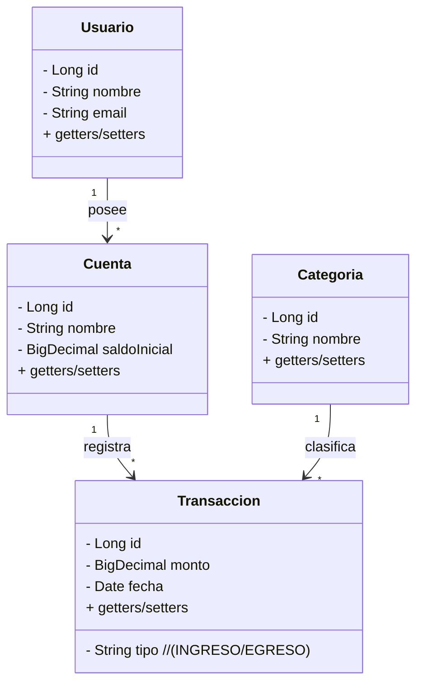
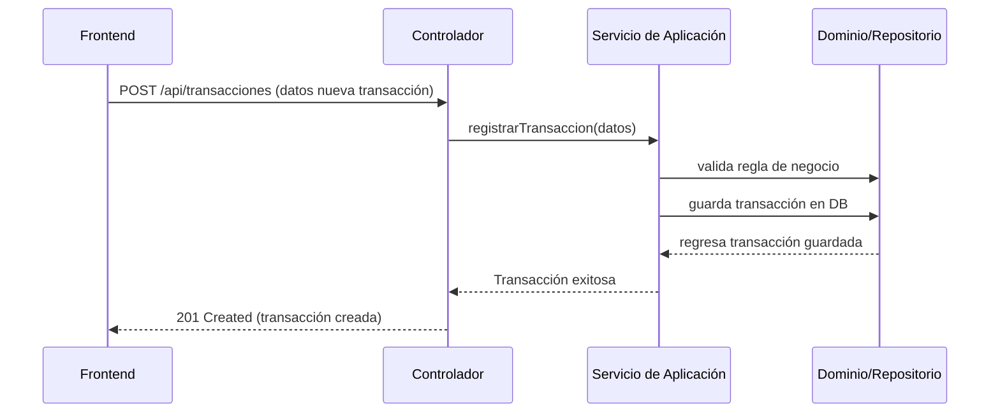

Volver a [Documentación general]({{ site.baseurl }}/gauge-implications/jineteapp/index/)

Bienvenido a la documentación oficial del **Backend** de Jineteapp.  
Este documento describe la **arquitectura**, el **funcionamiento**, las **entidades**, y la **configuración** de este proyecto, siguiendo un enfoque **Hexagonal** con **Java Spring Boot** y **PostgreSQL** como base de datos. 

---

## Tabla de Contenidos

1. [Introducción](#introducción)  
2. [Arquitectura General](#arquitectura-general)  
    - [Diagrama de Arquitectura](#diagrama-de-arquitectura-mermaid)  
3. [Dominio](#dominio)  
    - [Entidades Principales](#entidades-principales)  
    - [Diagrama de Clases](#diagrama-de-clases-mermaid)  
4. [Casos de Uso](#casos-de-uso)  
    - [Secuencia de un Caso de Uso (Mermaid)](#secuencia-de-un-caso-de-uso-mermaid)  
5. [Infraestructura](#infraestructura)  
    - [Controladores REST](#controladores-rest)  
    - [Persistencia](#persistencia-repositorios)  
    - [Configuraciones](#configuraciones)  
6. [Configuraciones y Ejecución](#configuraciones-y-ejecución)  
    - [Requerimientos](#requerimientos)  
    - [Instalación y Ejecución Local](#instalación-y-ejecución-local)  
    - [Variables de Entorno](#variables-de-entorno)  
    - [Migraciones de Base de Datos](#migraciones-de-base-de-datos)  
7. [Estructura de Carpetas](#estructura-de-carpetas)  
8. [Pruebas](#pruebas)  
9. [FAQ y Buenas Prácticas](#faq-y-buenas-prácticas)  
10. [Contacto y Contribuciones](#contacto-y-contribuciones)  

---

## Introducción

**Jineteapp** es un proyecto cuyo objetivo fue el de gestionar activamente mis jineteos. El concepto de Jineteo no se detallará ni será explícito en esta documentación. El **backend** se encarga de:

- Proveer la lógica de negocio y casos de uso.  
- Gestionar el acceso y persistencia de datos en la base de datos **PostgreSQL**.  
- Exponer una API REST para ser consumida por el **frontend** (construido en Angular) u otros servicios.

**Tecnologías Clave**:  
- Java 17+ (puede variar, revisa el `pom.xml`)  
- Spring Boot 2.x / 3.x  
- PostgreSQL  
- Arquitectura hexagonal  
- Lombok (para simplificar el código)  
- Herramientas de integración y pruebas (JUnit, Mockito, etc.)

---

## Arquitectura General

La aplicación sigue una **arquitectura hexagonal** (también conocida como Puertos y Adaptadores). El diagrama de alto nivel se compone de tres capas lógicas:

1. **Dominio (Domain)**  
   Contiene las **entidades** y **reglas de negocio** puras.  
2. **Aplicación (Application / Use Cases)**  
   Orquesta la lógica de negocio, implementando **servicios** y **casos de uso** que interactúan con el dominio y con el exterior.  
3. **Infraestructura (Infrastructure)**  
   Incluye adaptadores de entrada (controladores REST), adaptadores de salida (repositorios a la BD, integraciones con servicios externos), y configuraciones específicas de la tecnología (Spring, Hibernate, etc.).

~~~mermaid
flowchart LR
    A["Frontend (Angular)"] -->|REST| B["Controllers (Infraestructura)"]
    B --> C["Use Cases (Aplicación)"]
    C --> D[Dominio]
    D --> C
    C --> E["PostgreSQL (Repositorios)"]
~~~

En el diagrama anterior, los controladores (en la capa de Infraestructura) se comunican con los servicios de Aplicación (Use Cases), que a su vez manejan la lógica y llaman a los componentes de dominio y/o repositorios para persistir o consultar datos.

## Dominio

El **Dominio** define las **entidades** y **objetos de valor** centrales de Jineteapp, junto con la lógica de negocio pura (sin depender de frameworks).  
Ejemplos de entidades podrían ser:

- **Usuario** (User)  
- **Cuenta** (Account)  
- **Transacción** (Transaction)  
- **Categoría** (Category)

### Entidades Principales

| Entidad       | Descripción                                                                            |
|---------------|-----------------------------------------------------------------------------------------|
| **Usuario**   | Representa a la persona que usa la aplicación. Contiene campos como nombre, email, etc. |
| **Cuenta**    | Maneja la información de una cuenta bancaria o de otro tipo de activo financiero.       |
| **Transacción** | Registra ingresos y egresos, asocia montos, fechas, categoría, etc.                  |
| **Categoría** | Agrupa transacciones en rubros (alimentación, vivienda, transporte, etc.).              |

### Diagrama de Clases

## Casos de Uso

Los **casos de uso** (_Use Cases_) son las interacciones concretas con el sistema, por ejemplo:

- **Registrar nueva transacción**  
- **Actualizar saldo de la cuenta**  
- **Listar transacciones por categoría**  
- **Crear usuario**  
- **Editar y eliminar categoría**

Cada caso de uso se implementa en la capa de **Aplicación**, donde se orquesta la lógica necesaria entre el **Dominio** y la **Infraestructura**.

### Secuencia de un Caso de Uso

Tomemos como ejemplo el **registro de una nueva transacción**:

## Infraestructura

### Controladores REST

En la carpeta correspondiente (por ejemplo, `com.jineteapp.infrastructure.controller`), se definen las clases `@RestController` con métodos que responden a peticiones HTTP:

~~~java
@RestController
@RequestMapping("/api/transacciones")
public class TransaccionController {

    private final RegistrarTransaccionService registrarTransaccionService;

    public TransaccionController(RegistrarTransaccionService registrarTransaccionService) {
        this.registrarTransaccionService = registrarTransaccionService;
    }

    @PostMapping
    public ResponseEntity<TransaccionResponse> registrar(@RequestBody TransaccionRequest request) {
        TransaccionResponse response = registrarTransaccionService.ejecutar(request);
        return ResponseEntity.status(HttpStatus.CREATED).body(response);
    }
}
~~~

- `RegistrarTransaccionService` es un **servicio de aplicación** (caso de uso) que se encarga de la lógica de registrar transacciones.  
- Recibimos un `TransaccionRequest` desde el **frontend**, y devolvemos un `TransaccionResponse` con los datos de la transacción creada.

### Persistencia

En la carpeta `com.jineteapp.infrastructure.repository` o similar, se ubican las **interfaces** que extienden de `JpaRepository`:

~~~java
public interface TransaccionRepository extends JpaRepository<TransaccionEntity, Long> {
    // Métodos de consulta adicionales
}
~~~

- Estas interfaces facilitan la interacción con la base de datos PostgreSQL.  
- Se definen las **Entidades JPA** (p.ej. `TransaccionEntity`) que mapean las tablas de la BD.

### Configuraciones

En `src/main/resources/application.properties` (o `.yml`), se especifican ajustes como:

~~~properties
server.port=8080
spring.datasource.url=jdbc:postgresql://localhost:5432/jineteapp
spring.datasource.username=postgres
spring.datasource.password=secret
spring.jpa.hibernate.ddl-auto=update
~~~

Además, podemos tener archivos separados para diferentes **perfiles** (dev, prod, test), configuraciones de **Spring Security**, logs, etc.

## Configuraciones y Ejecución

### Requerimientos

- **Java 17+** (verificar la versión exacta usada en el `pom.xml` o en la documentación interna)  
- **Maven** (o Gradle, dependiendo del proyecto)  
- **PostgreSQL** corriendo localmente o en un contenedor Docker  
- Librerías y dependencias incluidas en el proyecto  

### Instalación y Ejecución Local

~~~bash
# 1. Clona el repositorio
git clone https://github.com/sasanchezramirez/jineteapp_back.git
cd jineteapp_back

# 2. Ajusta credenciales en application.properties o variables de entorno
# (ej. DB URL, usuario, contraseña)

# 3. Compila y ejecuta con Maven
mvn clean install
mvn spring-boot:run

# 4. Accede a la app
# http://localhost:8080/api
~~~

### Variables de Entorno

Puedes configurar los valores de conexión a la BD, puerto, etc. mediante **variables de entorno**, que luego se inyectan en `application.properties` o en tu `application.yml`.  
Ejemplo:

~~~properties
spring.datasource.url=${JINETEAPP_DB_URL}
spring.datasource.username=${JINETEAPP_DB_USER}
spring.datasource.password=${JINETEAPP_DB_PASS}
~~~

### Migraciones de Base de Datos

Si el proyecto usa **Flyway** (o **Liquibase**), encontrarás un directorio `db/migration` dentro de `src/main/resources/` con scripts SQL para crear/modificar las tablas.  
Cada cambio en la estructura de la BD debe registrarse con un nuevo script:

- `V1__create_tables.sql`  
- `V2__update_schema.sql`  
- etc.

## Estructura de Carpetas

A modo de referencia, la estructura típica del backend en **arquitectura hexagonal** podría lucir así:

~~~plaintext
jineteapp_back
 ┣ src
 ┃ ┣ main
 ┃ ┃ ┣ java
 ┃ ┃ ┃ ┗ com.jineteapp
 ┃ ┃ ┃ ┃ ┣ domain
 ┃ ┃ ┃ ┃ ┃ ┣ model
 ┃ ┃ ┃ ┃ ┃ ┣ service
 ┃ ┃ ┃ ┃ ┣ application
 ┃ ┃ ┃ ┃ ┃ ┣ usecase
 ┃ ┃ ┃ ┃ ┃ ┗ port
 ┃ ┃ ┃ ┃ ┣ infrastructure
 ┃ ┃ ┃ ┃ ┃ ┣ controller
 ┃ ┃ ┃ ┃ ┃ ┣ repository
 ┃ ┃ ┃ ┃ ┃ ┗ config
 ┃ ┃ ┣ resources
 ┃ ┃ ┃ ┣ application.properties
 ┃ ┃ ┃ ┗ db/migration
 ┣ pom.xml
 ┗ README.md
~~~

- **`domain`**: Entidades y lógica pura del negocio.  
- **`application`**: Servicios y casos de uso que coordinan la interacción entre dominio e infraestructura.  
- **`infrastructure`**: Adaptadores (controladores REST, repositorios JPA, configuración de Spring).

## Pruebas

- **Pruebas Unitarias**: Ubicadas típicamente en `src/test/java`, usando JUnit y Mockito.  
- **Pruebas de Integración**: Pueden usar Spring Boot Test para ejecutar el contexto real y verificar la interacción con la BD.  
- **Cobertura**: Se recomienda usar plugins de Maven (Jacoco, por ejemplo) para medir la cobertura.

Ejemplo de prueba unitaria (simplificado):

~~~java
@SpringBootTest
class RegistrarTransaccionServiceTest {

    @Autowired
    private RegistrarTransaccionService registrarTransaccionService;

    @Test
    void testRegistrarTransaccion() {
        TransaccionRequest request = new TransaccionRequest();
        // set campos en request...
        
        TransaccionResponse response = registrarTransaccionService.ejecutar(request);
        assertNotNull(response.getId());
        assertEquals(request.getMonto(), response.getMonto());
    }
}
~~~
## FAQ y Buenas Prácticas

1. **¿Por qué usar arquitectura hexagonal?**  
   Para mantener un **bajo acoplamiento** entre la lógica de negocio y la tecnología. Facilita el mantenimiento y la escalabilidad.

2. **¿Cómo manejar múltiples entornos (desarrollo, staging, producción)?**  
   Con **perfiles** (`application-dev.properties`, `application-prod.properties`) y **variables de entorno** para credenciales sensibles.

3. **Recomendaciones de seguridad**:
   - Implementar **JWT** u OAuth2 para proteger endpoints.
   - Evitar exponer datos sensibles (propiedades o logs con contraseñas).
   - Restringir CORS adecuadamente.

4. **Logs y monitoreo**:
   - Usar logs estructurados (SLF4J, Logback).
   - Integrar herramientas de monitoreo (Micrometer, Prometheus, etc.).
