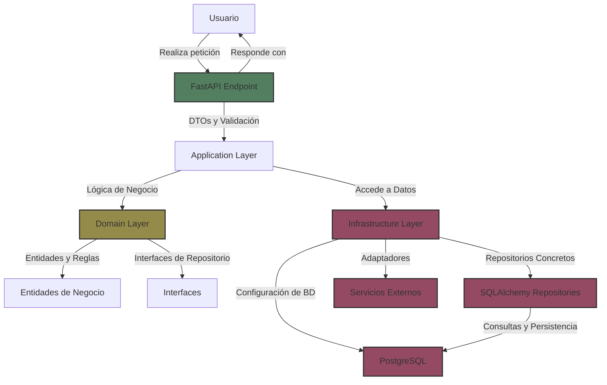

Volver a [Documentación general]({{ site.baseurl }}/gauge-implications/poop-manager/index/)

## Contenido
1. [Descripción del Proyecto](#descripción-del-proyecto)
2. [Arquitectura](#arquitectura)
3. [Tecnologías Utilizadas](#tecnologías-utilizadas)
4. [Configuración del Entorno](#configuración-del-entorno)
5. [Documentación de la API](#documentación-de-la-api)
6. [Autenticación y Autorización](#autenticación-y-autorización)
7. [Descripción de las Capas](#descripción-de-las-capas)
8.  [Roadmap del Proyecto](#roadmap-del-proyecto)

## Descripción del Proyecto

**Poop Manager Backend** es la parte central de un sistema diseñado para monitorear las visitas de una mascota al baño, gestionando datos en tiempo real y proporcionando información útil para la salud y el mantenimiento del área. La aplicación backend está construida con **FastAPI** y sigue los principios de **Arquitectura Hexagonal (Clean Architecture)** para garantizar un código modular, escalable y fácil de mantener.

---

## Arquitectura

La arquitectura del backend se basa en la **Arquitectura Hexagonal** o **Clean Architecture**, organizando el código en capas claramente definidas:




### Estructura de Directorios

```plaintext
back/
├── app/
│   ├── domain/         # Reglas de negocio, entidades e interfaces
│   ├── application/    # Configuración global del sistema
│   ├── infrastructure/ # Implementaciones técnicas, adaptadores y repositorios
│   ├── config/         # Configuraciones de la aplicación
│   └── main.py         # Punto de entrada de la aplicación
├── .env                # Variables de entorno
├── requirements.txt    # Dependencias del proyecto
├── Dockerfile          # Configuración de Docker
└── README.md           # Documentación
```

---

## Tecnologías Utilizadas

### **Core**
-  **Python 3.8+**: Lenguaje principal del proyecto.
-  **FastAPI**: Framework web moderno y de alto rendimiento (y mi favorito).
-  **SQLAlchemy**: ORM para interactuar con PostgreSQL.
-  **Pydantic**: Validación y gestión de datos.
-  **PostgreSQL**: Base de datos relacional principal.

### **Seguridad**
-  **JWT**: Autenticación segura.
-  **Bcrypt**: Hashing robusto de contraseñas.
-  **Python-multipart**: Manejo seguro de formularios.

### **Herramientas de Desarrollo**
-  **Uvicorn**: Servidor ASGI eficiente.
-  **Docker**: Containerización y despliegue.
-  **Python-dotenv**: Gestión de variables de entorno.

---

##  Configuración del Entorno

### Prerrequisitos
1. **Python 3.8+**
2. **PostgreSQL**
3. **Docker** (opcional para despliegue local)

### Variables de Entorno

Crea un archivo `.env` con las siguientes variables de configuración:

```plaintext
DATABASE_URL=postgresql://{user}:{password}@{host}:{port}/{database}
JWT_SECRET_KEY={secret_key}
JWT_ALGORITHM=HS256
ACCESS_TOKEN_EXPIRE_MINUTES={n-minutes}
```

### Instalación

1. **Clonar el repositorio:**
   ```bash
   git clone [url-del-repositorio]
   cd back
   ```

2. **Crear y activar un entorno virtual:**
   ```bash
   python -m venv venv
   source venv/bin/activate  # En Windows: venv\Scripts\activate
   ```

3. **Instalar dependencias:**
   ```bash
   pip install -r requirements.txt
   ```

4. **Iniciar la aplicación:**
   ```bash
   uvicorn app.main:app --reload
   ```

###  Usando Docker

1. **Construir la imagen:**
   ```bash
   docker build -t poop-manager-backend .
   ```

2. **Correr el contenedor:**
   ```bash
   docker run -p 8000:8000 poop-manager-backend
   ```

---

##  Documentación de la API

La documentación interactiva de la API está disponible en las siguientes rutas:

- 🌐 **Swagger UI**: `http://localhost:8000/docs` (o `http://{host}:{port}/docs`)
- 📄 **ReDoc**: `http://localhost:8000/redoc` (o `http://{host}:{port}/redoc`)

---

##  Autenticación y Autorización

El backend utiliza **JSON Web Tokens (JWT)** para autenticación segura:

1. **Registro de usuario**: `/auth/register`
2. **Inicio de sesión**: `/auth/login` → devuelve un token de acceso.
3. **Uso del token**: Incluir en las peticiones HTTP:
   ```http
   Authorization: Bearer <token>
   ```

---

##  Descripción de las Capas

### 1. **Domain**:
- Define las **entidades** y **reglas de negocio**.
- Interfaces de repositorios y servicios.
- Contiene Value Objects para conceptos específicos.
- Implementación de **casos de uso** (lógica de la aplicación).


### 2. **Application**:
- Define la **inyección de dependencias** y **configuración global del sistema**.
- Establce la instaciación de las variables de entorno.
- Configuración de **logging** y **configuración de la salida de errores**.

### 3. **Infrastructure**:
- Driven-Adapter:
   - Repositorios concretos de persistencia con SQLAlchemy.
   - Configuraciones de la base de datos.
   - Adaptadores de API externas.
   - Define **DTOs** (Data Transfer Objects) y mapeos entre datos.
- Entry-Point:
   - Establece las rutas de entrada y los endpoints de la API.
   - Configuración de **CORS** y **autenticación y autorización**. 

{: width="972" height="589" }
_Esquema de las capas_

---


##  Roadmap del Proyecto

### Próximas Características
- [ ] Sistema avanzado de métricas y analytics.
- [ ] Integración con notificaciones (email o push).
- [ ] Reportes personalizados para los usuarios.

### En Desarrollo
- [ ] Optimización de la autenticación.
- [ ] Monitoreo y optimización de consultas a la base de datos.

---

Volver a [Documentación general]({{ site.baseurl }}/gauge-implications/poop-manager/index/)