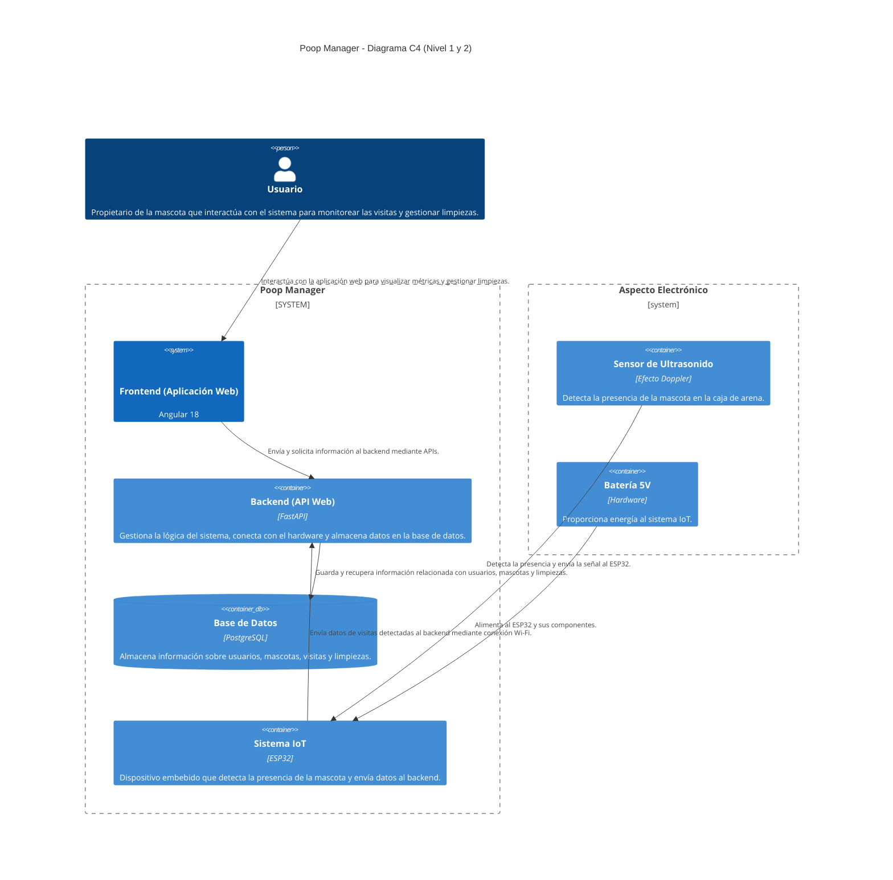

Aquí encontrarás la **documentación general** del proyecto, para los casos específicos puedes visitar la documentación específica para:

- [Front]({{ site.baseurl }}/gauge-implications/poop-manager/front/)
- [Back]({{ site.baseurl }}/gauge-implications/poop-manager/back/)
- [Hardware]({{ site.baseurl }}/gauge-implications/poop-manager/hardware/)

## Contenido
1. [Objetivos Principales](#objetivos-principales)
2. [Funcionalidades del Sistema](#funcionalidades-del-sistema)
3. [Diagrama de Arquitectura](#diagrama-de-arquitectura)
4. [Requisitos Técnicos](#requisitos-técnicos)
5. [Métricas](#métricas)
6. [Funcionalidad Adicional](#)
7. [Detalles de la documentación](#detalles-de-la-documentación)

## Objetivos Principales
Poop Manager es un proyecto que combina componentes web y electrónicos para monitorear las veces que mi mascota (Chaplin) entra a su caja de arena, con el objetivo de conocer su comportamiento y monitorear la salud de su alimentación y digestión. 

Es además un desafío personal de profundizar en conocimientos técnicos mientras construyo un prototipo útil.

## Funcionalidades del Sistema
### Aspecto Electrónico
- Utiliza un sensor de efecto Doppler de ultrasonido para detectar la presencia de la mascota en el baño.
- El sensor envía una señal vía API utilizando un ESP32.
- Está alimentado por una batería de 5V y realiza mediciones cada 5 segundos.

### Aspecto Web
- Creación de usuarios y acceso a datos mediante autenticación.
- Almacenamiento de información de usuarios y mascotas en una base de datos.
- Recopilación de datos de múltiples mascotas por usuario.
- Presentación de métricas relacionadas a la actividad de la mascota.

### Estado del proyecto

Los hitos importantes del proyecto se resumen en los siguientes:

- [ ] Infraestructura
- [ ] Capa de usuario
- [ ] Capa lógica
- [ ] Implementación hardware

En este momento, se tiene el siguiente estado de avance del proyecto

  

    55%
  

## Diagrama de Arquitectura
>En caso de ser necesario puede activar el modo *light* en el sidebar sobre la parte inferior.
{: .prompt-warning }

## Requisitos Técnicos
### Software
- Frontend construido con Angular 18.
- Backend construido con FastAPI en Python.

>Para mayor detalle técnico sobre el software, diríjase a las secciones de [Backend]({{ site.baseurl }}/gauge-implications/poop-manager/back/) y [Frontend]({{ site.baseurl }}/gauge-implications/poop-manager/front/).
{: .prompt-info }

### Hardware
- Sensor de efecto Doppler de ultrasonido.
- Módulo ESP32.
- Batería de 5V para alimentar el sistema.

>Para mayor detalle sobre el hardware, consulta la sección [Hardware]({{ site.baseurl }}/gauge-implications/poop-manager/hardware/).
{: .prompt-info }

## Métricas
- Cantidad de veces que la mascota entra al baño, la hora y el día.
- Cálculo del promedio de visitas diarias y nocturnas.
- Identificación de patrones y detección de desviaciones importantes.

## Funcionalidad Adicional
- Gestión de limpiezas del baño de la mascota.
- Recomendación de cuándo realizar limpiezas basada en el número de visitas.
- Historial de limpiezas y visualización de la última limpieza realizada.

## Detalles de la documentación:

- [Front]({{ site.baseurl }}/gauge-implications/poop-manager/front/)
- [Back]({{ site.baseurl }}/gauge-implications/poop-manager/back/)
- [Hardware]({{ site.baseurl }}/gauge-implications/poop-manager/hardware/)
<!-- - [Esquemas de datos]({{ site.baseurl }}/gauge-implications/poop-manager/data-schemas/) -->